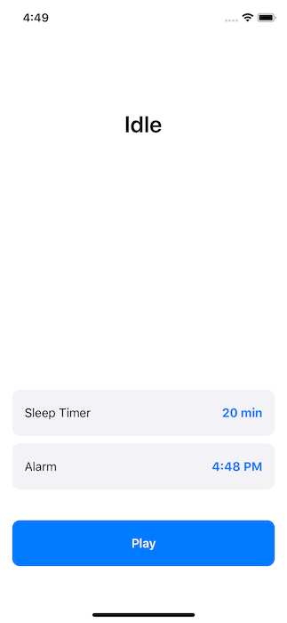

# Sleep Time

Xcode 11.5, Swift 5, iOS 13

## Key Features

- Play/pause/stop audio.
- Play audio in the loop during the given duration.
- Play audio in the background.
- Record audio in the background.
- Record audio in the background after delay.
- Local notifications.
- MVP pattern (UIKit).
- Custom modal transition.

## App Screen

	

